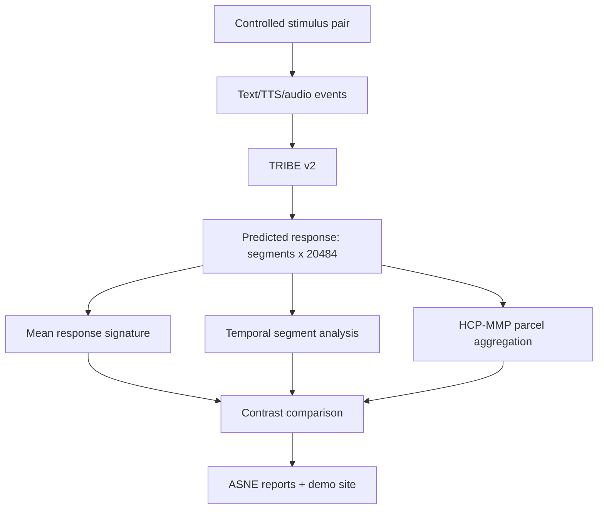

# ASNE Project Summary

## One-line summary

ASNE is a TRIBE-backed in-silico semantic contrast analysis system that compares predicted cortical response signatures across controlled stimuli.

## Why it matters

TRIBE v2 predicts cortical responses from text/audio/video stimuli. ASNE adds the experiment, dictionary, comparison, temporal, and parcel-level reporting layer around it.

## What ASNE does

```text
Stimulus pair
-> text/TTS/audio events
-> TRIBE v2 prediction
-> predicted cortical response [segments, 20484]
-> mean, temporal, and HCP-MMP parcel signatures
-> contrast comparison
-> static report
```



## Current v0.3 findings

- `expected_vs_unexpected`: stable
- `cause_effect_valid_vs_invalid`: stable/viable
- `contradiction_vs_consistency`: weak/deprioritized after larger eval
- `approach_vs_static`: low priority for text/TTS, likely needs video-native input

## What we proved

- TRIBE predictions can be turned into reusable stimulus-response dictionaries.
- Semantic outcome/anomaly contrasts separate better than motion-style narrated contrasts.
- HCP-MMP parcel scoring preserves or improves benchmark accuracy while making results interpretable.
- Temporal segment analysis can reveal late response shifts hidden by mean averaging.

## What we did not prove

- Not measured brain activity.
- Not emotion detection.
- Not diagnosis.
- Not a stable production classifier.
- Current eval sets are still small.

## Current public demo

https://hikaru051058.github.io/ASNE/

## Next technical direction

Video-native contrasts and/or larger semantic anomaly benchmark.
